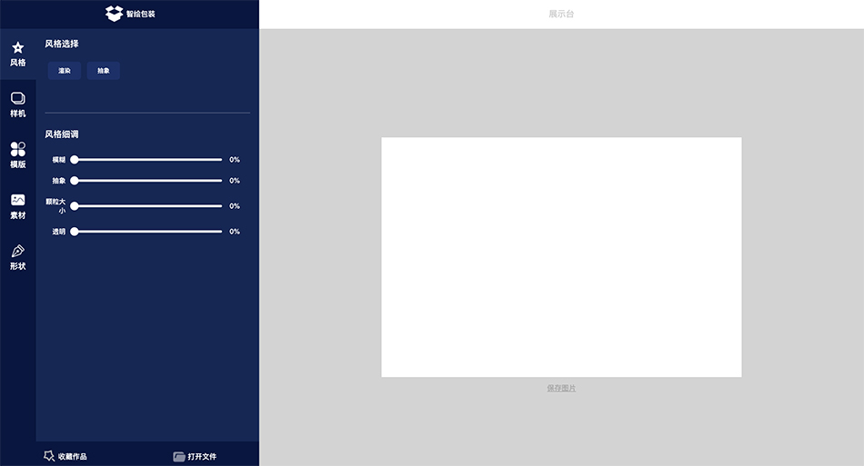

# PackDesignPlatform

## Prerequisite

> This a project written with flask as service and React for fontend.

### Backend

#### Basic
* python 3.7+
* flask

### Optional 
> They are for zitong's thesis work, you can omit them by deleting related functions.
* pytorch (for stylished background generated)
* cuda (for GPU using)
* Matlab engine support (for packdesign template decision, visual clutter computation.)

#### Setting up
1. Setting up [virtural environment](https://docs.python.org/zh-cn/3/library/venv.html);
2. Install requirements, including [pytorch and cuda](https://pytorch.org/);
3. Set up Matlab engine (See [this](https://ww2.mathworks.cn/help/matlab/matlab_external/get-started-with-matlab-engine-for-python.html) to learn how to install support and [this](https://ww2.mathworks.cn/help/matlab/matlab-engine-for-python.html) to know how to call matlab functions from python);

### Fontend
* npm
* React
* html2cavas
* rc-slider
* react-three-fiber

#### Setting up

``` bash
cd PATH/PackDesignPlatform/packdesign/fontend
npm install
```


## Programming in Development Enviroment

Under development mode, you can either implement new feature for only backend or fontend service, or develop together. Backend service is needed for successfully display of some materials such as background images generated by GAN or icons . 

### (Backend) Start Flask Service

1. Make sure in PackDesignPlatform directory  
``` bash
cd PATH/PackDesignPlatform
```

2. Add environment variable  
``` bash
export FLASK_APP=packdesign  
export FLASK_DEV=development
```

3. Open flask service
``` bash
flask run
// (Then flask service will run at default port 5000. Or, you can specify port using -p parameter) 
// flask run -p YOUR_PORT 
``` 

4. Bowser `http://127.0.0.1:YOUR_PORT` or `localhost:YOUR_PORT`

5. If no error massages in your browser and but an empty html... Congrats! Flask service is running successfully since we are in development mode and fontend pages have not built in


### (Fontend) Start React Service

1. Make sure in PackDesignPlatform/packdesign/fontend directory  
``` bash
cd PATH/PackDesignPlatform/packdesign/fontend
```

2. Start service with npm
``` bash
npm start
// (Then flask service will run at default port 3000. Or, you can specify port by specifying PORT variable) 
// PORT=YOUR_PORT npm start
``` 

3. Bowser `http://127.0.0.1:YOUR_PORT` or `localhost:YOUR_PORT`

4. You can see index pages as 



## Deployment

Have not tried yet.......  
Some reference docs may help:  
* [React创建项目并打包到Flask后端](https://www.jianshu.com/p/b348926fa628?from=timeline@)  
* [React+Flask打造前后端分离项目开发环境](https://www.cnblogs.com/sikongji-yeshan/p/12188076.html)  
* [实例讲解基于Flask+React的全栈开发和部署](https://segmentfault.com/a/1190000007706773)

